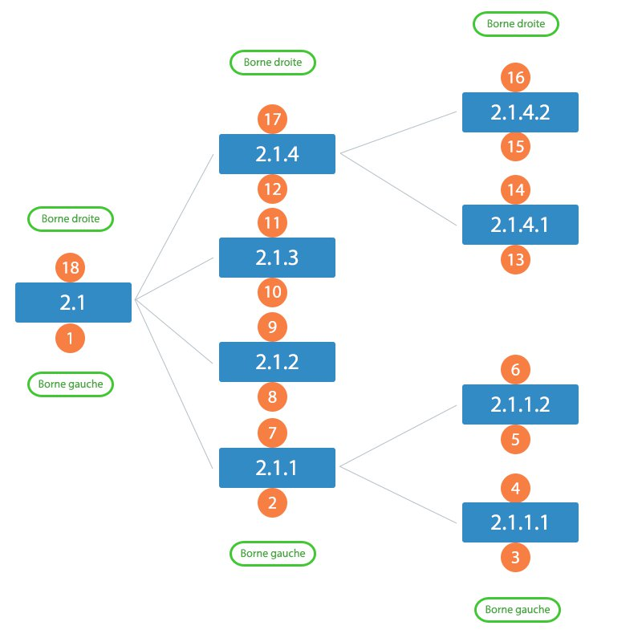

Ici, on va voir comment mettre à jour un élément : mettre ses bornes à jour (ajout / suppression d'éléments),
déplacement de nœuds... Bref, on va s'amuser à mettre à jour notre arbre.

Dans cette partie du tutoriel, nous allons voir quelques concepts intéressants, nous montrerons qu'en fait notre arbre
est loin d'être immuable : nous pouvons rajouter ou enlever des nœuds, et même les déplacer ! Nous verrons d'abord
l'ajout et la suppression, actions nécessaires pour bien comprendre le déplacement ensuite, qui lui est assez complexe
et peut être divisé en plusieurs sous-parties, que nous aborderons alors en temps et en heure.

Ajout et/ou suppression d'éléments
==================================
Le cas des feuilles
-------------------
Avant de s'amuser à pouvoir véritablement insérer ou retirer des nœuds dans le sens général du terme, regardons un peu
comment le faire dans un cas un peu plus particulier, celui des feuilles. Celui-ci demande moins de réflexion, mais est
tout de même assez intéressant pour comprendre le concept derrière la modification d'un arbre.

On va donc insérer une nouvelle feuille au nœud ayant l'id N°5. Même si dans ce cas très précis, on connaît déjà la
borne gauche (`8`) et la borne droite (`9`) de cet élément, nous allons tout de même nous mettre dans un cas réel où ces
deux bornes ne sont en général pas encore connues ; il nous faut alors les récupérer via une requête de type `SELECT`. 
En général, seule la sélection de la borne droite et – si on suit l'architecture, qui, je le rappelle, est facultative –
de la profondeur suffit.

On aura également besoin de faire 2 requêtes `UPDATE` : changer les bornes droites puis les gauches de tous les éléments
à partir desquels on souhaite insérer la nouvelle feuille. Donc, à chacun des nœuds concernés par cette modification
(donc la feuille ayant l'id n°5 et les suivantes), on va incrémenter tout d'abord leur borne droite de 2, puis la borne
gauche de 2 également. Faire ici deux requêtes nous évitera d'avoir une incohérence dans les bornes de nos tables. Une
explication sur "pourquoi ajouter 2" viendra lorsque nous aborderons le cas des nœuds en général.

Enfin, on insère la nouvelle feuille par la droite. Pourquoi ? Lorsqu'on insère un élément, par pure logique, il est
préférable de d'abord faire de la place pour celui-ci, et pour ne pas avoir de bornes négatives, on pousse alors les
éléments qui seront situés après le nôtre vers la droite, pour qu'aucune borne ne puisse être négative, risquant ainsi
d'invalider notre arbre au milieu de notre transaction.

```sql
SELECT node_right, node_depth
    FROM tuto_ri
    WHERE id = 5;

/* 
 * Ainsi, on sait que node_right vaut 9 et que la profondeur est de 1 ; tous les
 * éléments ayant une borne gauche et une borne droite supérieures à 9 seront mis
 * à jour par les deux requêtes qui suivent. 
 *
 * Notre feuille aura alors comme borne 9 et 9+1 = 10, et aura pour profondeur
 * node_depth + 1 = 1 + 1 = 2.
 */

UPDATE tuto_ri
    SET node_right = node_right + 2
    WHERE node_right >= 9;

UPDATE tuto_ri 
    SET node_left = node_left + 2
    WHERE node_left >= 9;

INSERT INTO tuto_ri (node_depth, node_left, node_right) 
    VALUES (2, 9, 10);
```

Lorsqu'on sélectionne les données, on trouve la feuille insérée à la bonne place :


+------+--------------+-------------+--------------+
| `id` | `node_depth` | `node_left` | `node_right` |
+------+--------------+-------------+--------------+
| 1    | 0            | 1           | 20           |
+------+--------------+-------------+--------------+
| 2    | 1            | 2           | 7            |
+------+--------------+-------------+--------------+
| -> ... <-                                        |
+------+--------------+-------------+--------------+
| 5    | 1            | 8           | 11           |
+------+--------------+-------------+--------------+
| -> ... <-                                        |
+------+--------------+-------------+--------------+
| 10   | 2            | 9           | 10           |
+------+--------------+-------------+--------------+


**NB :** Vous pouvez ainsi transformer une feuille en un nœud, tel qu'on vient ici de le faire.

Je pense que vous devinerez comment supprimer une feuille : le topo est à peu près le même que pour l'insertion, sauf
que cette fois-ci on procède en sens inverse.

```sql
/* Même si on connaît la borne gauche de l'élément à supprimer, mettons-nous dans un cas où ce n'est justement pas le cas */
SELECT node_left
    FROM tuto_ri
    WHERE id = 21;

/* on sait donc que la borne gauche de notre élément est 9 ; on peut donc procéder à la suite */

DELETE 
    FROM tuto_ri
    WHERE node_left = 9;

UPDATE tuto_ri
    SET node_left = node_left - 2
    WHERE node_left >= 9;

UPDATE tuto_ri
    SET node_right = node_right - 2
    WHERE node_right >= 9;
```

**NB :** Pour la suppression, vous n'êtes pas obligés de tout redécaler, mais suivez mon conseil, et faites-le,
histoire d'avoir un arbre plus propre et ne pas avoir "trop" de trous. Ceux-ci peuvent devenir problématiques par la
suite, spécialement concernant l'organisation et des statisques sur vos nœuds (je pense par exemple au nombre
d'enfants pour un nœud précis).

Maintenant, si vous êtes toujours là, on va aborder la même chose... Mais dans le cas général !

Le cas général : l'insertion et la suppression d'un nœud dans un arbre
======================================================================
Je ne pense pas avoir besoin de trop détailler. Vous avez juste besoin de connaître les bornes de l'arbre à insérer, le
nombre d'éléments qu'il contient, et ça devrait faire l'affaire si on emploie la même méthode que tout à l'heure. Voici
l'arbre[^schema] que l'on va chercher à insérer :

[^schema]: Réalisé par [Shadow_f](http://fr.openclassrooms.com/membres/shadowf-91614)



On va donc rattacher cet arbre à la feuille ayant l'id n°5, et donc – en considérant notre arbre propre, sans la
feuille rajoutée lors de l'exercice précédent – les bornes 8 et 9. Avant de commencer, rendons l'arbre à insérer
compatible avec le nœud d'accueil. Pour cela, il nous faut ajouter la borne droite du nœud d'accueil, auquel on
retranche un (en effet, la borne gauche du premier élément de l'arbre à insérer commence à 1 et pas 0 !). Soit ici 
$9 - 1 = 8$.

Occupons-nous maintenant de provoquer un trou dans l'arbre d'accueil. Souvenez-vous du calcul du nombre d'enfants que
nous avions abordé dans la partie théorique : 

$$ \begin{array}{lcl}\text{borne droite} - \text{borne gauche} & = & 18 - 1 \\\ 
                                                                & = & 17 \\\ 
                                                                & = & 16 + 1 \\\ 
                                                                & = & \boxed{8} \times 2  + 1
\end{array}$$

Si on compte l'élément racine, ça nous fait donc : $8 + 1 = \bf{9}$ éléments) ; il faudra donc ajouter **18** aux
bornes gauche et droite des éléments ayant une borne supérieure ou égale à 9. Vous pouvez maintenant faire le
rapprochement avec l'ajout d'une feuille : nous ajoutions 2 aux bornes à modifier, car il y avait un élément à insérer. 

```sql
SELECT node_right, node_depth
    FROM tuto_ri
    WHERE id = 5;

/*
 * node_right vaut donc 9, et node_depth 1
 */ 

UPDATE tuto_ri
    SET node_right = node_right + 18
    WHERE node_right >= 9;

UPDATE tuto_ri 
    SET node_left = node_left + 18
    WHERE node_left >= 9;

INSERT INTO tuto_ri (node_depth, node_left, node_right) 
        VALUES 
        (2, 9, 26),
        (3, 10, 15),
        (3, 16, 17),
        (3, 18, 19),
        (3, 20, 25),
        (4, 11, 12),
        (4, 13, 14),
        (4, 21, 22),
        (4, 23, 24);
```

+------+--------------+-------------+--------------+ 
| `id` | `node_depth` | `node_left` | `node_right` |
+------+--------------+-------------+--------------+
| 1    | 0            | 1           | 38           |
+------+--------------+-------------+--------------+
| 2    | 1            | 2           | 7            |
+------+--------------+-------------+--------------+
| -> ... <-                                        |
+------+--------------+-------------+--------------+
| 5    | 1            | 8           | 27           |
+------+--------------+-------------+--------------+
| -> ... <-                                        |
+------+--------------+-------------+--------------+
| 10   | 2            | 9           | 26           |
+------+--------------+-------------+--------------+
| 11   | 3            | 10          | 15           |
+------+--------------+-------------+--------------+
| 12   | 3            | 16          | 17           |
+------+--------------+-------------+--------------+
| 13   | 3            | 18          | 19           |
+------+--------------+-------------+--------------+
| 14   | 3            | 20          | 25           |
+------+--------------+-------------+--------------+
| 15   | 4            | 11          | 12           |
+------+--------------+-------------+--------------+
| 16   | 4            | 13          | 14           |
+------+--------------+-------------+--------------+
| 17   | 4            | 21          | 22           |
+------+--------------+-------------+--------------+
| 18   | 4            | 23          | 24           |
+------+--------------+-------------+--------------+

Et voici la suppression (vous pouviez la deviner, c'est à peu près la même chose que l'insertion), sauf qu'il faut cette
fois-ci récupérer les deux bornes du nœud racine à enlever :

```sql
/* 
 * Même si on connaît la borne gauche et la borne droite de l'élément à
 * supprimer, mettons-nous dans un cas où ce n'est justement pas le cas 
 */
SELECT node_left, node_right
    FROM tuto_ri
    WHERE id = 10;

/*
 * On sait donc que la borne gauche de notre élément est donc de 9, et sa borne
 * droite est 26
 */

/* Même si on le connait, récupérons le nombre d'éléments à supprimer */
SELECT COUNT(*)
    FROM tuto_ri
    WHERE node_left >= 9
        AND node_right <= 26

DELETE 
    FROM tuto_ri
    WHERE node_left >= 9 
        AND node_right <= 26;

UPDATE tuto_ri
    SET node_left = node_left - 18
    WHERE node_left > 9;

UPDATE tuto_ri
    SET node_right = node_right - 18
    WHERE node_right > 26;
```

C'était tout simplement un mélange entre l'application de la suppression d'une feuille et l'insertion d'un arbre. Comme
pour la suppression d'une feuille, les mises à niveau des bornes de l'arbre dans lequel on a supprimé notre nœud ne sont
pas obligatoires, mais restent un plus non négligeable pour avoir un arbre propre, et évitera surtout de fausser les
statistiques des nœuds. Comme pour l'insertion, pour connaître le nombre à soustraire aux deux bornes, il "suffisait" de
connaître le nombre d'éléments à supprimer et de le doubler.

Maintenant qu'on a vu comment insérer et supprimer un nœud d'un arbre, nous allons voir un autre point très intéressant
dans la manipulation des arbres : le déplacement de nœuds, qui est en fait une sorte de combinaison de ces deux derniers
exercices.

Déplacement d'un nœud
=====================
Comme je vous le disais, le déplacement d'un nœud se résume basiquement à deux actions : la "suppression" d'un nœud,
et sa "réinsertion".

Mais comme un bon exemple vaut mieux qu'un long discours, tâchons par exemple de déplacer le nœud n°7, et mettons-le 
à l'extrémité du nœud n°2. J'ai volontairement omis les bornes de ces deux nœuds, pour nous mettre dans un cas où nous
ne les connaissons pas. Profitons-en pour également connaître le nombre d'enfants que nous déplaçons.

```sql
SELECT node_left, node_right
    FROM tuto_ri
    WHERE id IN (2, 7);
```

 `id` | `node_left` | `node_right`
 ---- | ----------- | -------------
    2 | 2           | 7
    7 | 12          | 17

```sql
SELECT COUNT(*)
    FROM tuto_ri
    WHERE node_left >= 12
        AND node_right <= 17;
```

| `COUNT(*)` |
| ---------- |
| 3          |

Je parlais de suppression, et maintenant qu'on a toutes les informations à notre disposition, on va donc pouvoir
*supprimer* le nœud que nous souhaitons déplacer... Attention, notez bien l'italique sur l'emploi du mot supprimer !
En effet, nous n'allons pas le supprimer de la base de donnée, nous allons juste nous contenter de le cacher dans notre
arbre. On appelle ça une **zone temporaire**.

Pour déplacer un arbre en zone temporaire, il existe deux façons ; soit on met les bornes de notre arbre en négatif,
soit en un nombre faramineusement grand. Par préférence, je préfère nettement la première solution ; il est en effet
difficile de prévoir la taille de notre arbre, ou de celui de destination. Alors que si nous nous contentons de mettre
le nœud déplacé en zone négative, notre arbre peut alors continuer de grossir sans poser trop de problèmes.

Pour cela, il suffit de *retrancher* la borne droite du nœud à déplacer à *toutes* ses bornes (gauche comme droite) ;

```sql
UPDATE tuto_ri
    SET node_left = node_left - 17, node_right = node_right - 17
    WHERE node_left >= 12 AND node_right <= 17;
```

Mais maintenant qu'on a "supprimé" notre nœud, et comme nous l'avons vu dans le point précédent, il nous faut alors
reboucher le trou ;

```sql
UPDATE tuto_ri
    SET node_left = node_left - 3 * 2
    WHERE node_left > 12;

UPDATE tuto_ri
    SET node_right = node_right - 3 * 2
    WHERE node_right > 17;
```

Maintenant que notre nœud est en zone temporaire, il nous faut dès à présent ouvrir un trou où nous le souhaitons, soit
*à l'extrémité du nœud ayant pour bornes (2, 7)*. Il s'agit du cas que nous avons déjà vu dans la sous-partie
précédente ; nous nous occuperons de voir l'autre cas par la suite.

```sql
UPDATE tuto_ri
    SET node_right = node_right + 3 * 2
    WHERE node_right >= 7

UPDATE tuto_ri
    SET node_left = node_left + 3 * 2
    WHERE node_left >= 7;
```

Le trou est ouvert ; il ne nous reste plus qu'a réinsérer notre nœud à l'endroit qui convient. Pour cela, plutôt que de
faire comme nous avions fait précédemment (soit une bête insertion), il faut juste manipuler les bornes du nœud à
déplacer, en leur ajoutant l'ancienne valeur de la borne droite du nouveau parent, le nombre d'éléments dans le nœud
à déplacer, et à multiplier le tout par deux pour avoir une différence de bornes consistante.

```sql
UPDATE tuto_ri
    SET node_right = node_right + 7 + 3 * 2
    WHERE node_right <= 0;

UPDATE tuto_ri
    SET node_left = node_left + 7 + 3 * 2
    WHERE node_left <= 0;
```

Félicitations, vous avez réussi à déplacer le nœud n°7 dans le nœud n°2.

Au fil de cette explication, Je vous ai parlé de cas un peu spéciaux, qui sont en fait vrai pour l'insertion comme pour
le déplacement de nœud ; on a en effet abordé que le cas où nous souhaitions juste insérer notre nœud en tant que
_**dernier** enfant du nœud d'accueil_. Et maintenant que nous avons vu le déplacement en détail, nous pouvons ainsi
voir que les cas suivants existent :

- Nous souhaitons insérer le nœud **avant** les autres enfants du nœud d'accueil
- Nous souhaitons insérer le nœud **après** un enfant bien particulier du nœud d'accueil
- Nous souhaitons insérer le nœud **après** le dernier enfant du nœud d'accueil (s'il en a)

Nous avons déjà traité le troisième cas ; attardons-nous sur les deux premiers cas. En fait, ils ne sont pas si
compliqués que ça ; il y a juste quelques paramètres qui changent. Même si la mise en "zone temporaire" et le rebouchage
qui suit ne change pas, observons quand même le moment où nous créons un trou et le moment où on insère effectivement
notre nœud dans le nœud d'accueil.

Dans le premier cas (nous souhaitons alors insérer notre nœud **avant** ses frères), plutôt que de se baser sur la
borne *droite* du parent, basons-nous plutôt sur sa borne *gauche*. Nos requêtes deviennent donc les suivantes :

```sql
UPDATE tuto_ri
    SET node_right = node_right + 3 * 2
    WHERE node_right > 2;

UPDATE tuto_ri
    SET node_left = node_left + 3 * 2
    WHERE node_left > 2;

UPDATE tuto_ri
    SET node_right = node_right + 2 + 3 * 2
    WHERE node_right <= 0;

UPDATE tuto_ri
    SET node_left = node_left + 2 + 3 * 2
    WHERE node_left <= 0;
```

Pour le second cas (nous souhaitons alors insérer notre nœud **après** un de ses frères), plutôt que de se baser sur la
borne droite du *parent*, nous allons alors nous focaliser sur la borne droite du *frère*. Mettons que nous souhaitons
déplacer le nœud n°7 **après** le nœud n°3. Une sélection des bornes de ce nœud nous indique alors que ses bornes ont
pour valeur le tuple (3, 4).

```sql
UPDATE tuto_ri
    SET node_right = node_right + 3 * 2
    WHERE node_right > 4;

UPDATE tuto_ri
    SET node_left = node_left + 3 * 2
    WHERE node_left > 4;

UPDATE tuto_ri
    SET node_right = node_right + 4 + 3 * 2
    WHERE node_right <= 0;

UPDATE tuto_ri
    SET node_left = node_left + 4 + 3 * 2
    WHERE node_left <= 0;
```

Félicitations, vous avez maintenant vu comment déplacer et insérer un nœud à n'importe quel endroit de votre arbre !

